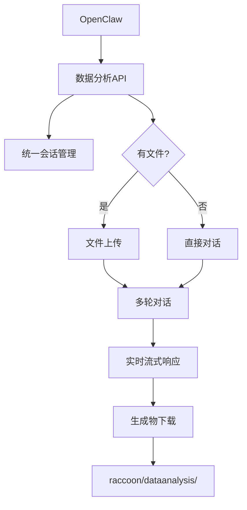

# 🦝 小浣熊数据分析技能 (Raccoon Data Analysis Skill)

> 为 OpenClaw 设计的**企业级远程数据分析解决方案**，通过小浣熊数据分析 API 提供专业的数据分析、可视化和代码执行能力。

## ✨ 核心特性

- 🔄 **统一接口架构** - 全面使用数据分析API，简化系统复杂度
- 📊 **专业可视化** - 雷达图、柱状图、散点图、热力图等
- 📁 **多格式支持** - Excel、CSV、图片、文件处理
- ⚡ **流式交互** - 实时显示分析过程和代码执行
- 🛡️ **远程安全** - 沙盒环境执行，零本地数据泄露
- 🔄 **智能重试** - 3层重试机制，指数退避策略

## 🏗️ 架构设计



### 🎯 统一处理流程

| 步骤 | 有文件场景 | 无文件场景 | 输出位置 |
|------|------------|------------|----------|
| **1** | 创建会话 | 创建会话 | 远程会话ID |
| **2** | 上传文件 | - | 文件ID (如适用) |
| **3** | 发起对话 | 发起对话 | 流式响应 |
| **4** | 下载生成物 | 下载生成物 | `./raccoon/dataanalysis/` |

## 📁 项目结构

```
raccoon-dataanalysis-skill/
├── references/                  # 📚 API 参考文档
│   ├── API_REFERENCE.md         # 完整接口说明 (11.3KB)
│   └── CHEATSHEET.md           # 快速参考 (3.9KB)
├── scripts/
│   └── main.py                 # 🔧 核心数据分析客户端 (精简版)
├── SKILL.md                    # 🎯 技能使用规范
└── README.md                   # 📖 项目说明
```

## 🚀 快速开始

### 1️⃣ 环境配置

```bash
export RACCOON_API_HOST="https://xiaohuanxiong.com"
export RACCOON_API_TOKEN="your-api-token"
```

### 2️⃣ 验证连接

```bash
python3 scripts/main.py auth-check
```

### 3️⃣ 开始分析

**📊 Excel文件分析**
```bash
python3 scripts/main.py analyze \
  --file "/path/to/sales_data.xlsx" \
  --prompt "分析月度销售趋势，生成可视化报告"
# 🔄 统一流程: 会话创建 → 文件上传 → 分析对话 → 生成物下载
```

**🧮 纯数学计算**
```bash
python3 scripts/main.py analyze \
  --prompt "实现K-means聚类算法，生成500个样本数据并可视化结果"
# 🔄 统一流程: 会话创建 → 分析对话 → 生成物下载
```

## 💡 实际应用场景

### 📈 商业数据分析
```bash
# 销售数据洞察
python3 scripts/main.py analyze \
  --file "Q3_sales.xlsx" \
  --prompt "按地区和产品线分析销售表现，识别增长机会" \
  --show-code

# 客户行为分析
python3 scripts/main.py analyze \
  --file "user_behavior.csv" \
  --prompt "分析用户留存率和转化漏斗，生成executive summary"
```

### 🎓 学术研究
```bash
# 心理测评可视化
python3 scripts/main.py analyze \
  --file "psychology_survey.xlsx" \
  --prompt "绘制多维度雷达图，比较不同组别的心理健康指标"

# 实验数据统计
python3 scripts/main.py analyze \
  --file "experiment_results.csv" \
  --prompt "执行t检验和方差分析，生成统计报告和箱线图"
```

### 🔬 算法开发
```bash
# 机器学习实验
python3 scripts/main.py analyze \
  --prompt "实现并比较SVM、随机森林、神经网络在鸢尾花数据上的性能"

# 数值模拟
python3 scripts/main.py analyze \
  --prompt "蒙特卡洛模拟股票价格路径，计算VaR和期权定价"
```

## 🔧 高级功能

### 🐍 Python API 集成
```python
from scripts.main import RaccoonClient

# 初始化客户端
client = RaccoonClient()

# 多轮交互分析
session = client.create_session('股票分析项目')
sid = session['id']

# 上传数据
file_id = client.upload_temp_file('stock_prices.csv')

# 第一轮：基础分析
result1 = client.chat(sid, '计算技术指标：MA20、MACD、RSI',
                      upload_file_ids=[file_id])

# 第二轮：深度分析
result2 = client.chat(sid, '基于技术指标预测未来5天走势，生成交易信号')

# 下载所有图表和报告
artifacts = client.download_artifacts(sid)
print(f"生成了 {len(artifacts)} 个分析报告")
```

## ⚡ 技术亮点

### 🏗️ 架构优势
- **统一接口**: 使用单一数据分析接口，架构简洁清晰
- **完整会话**: 所有请求(含纯计算)都有会话管理和追问能力
- **易于维护**: 统一代码路径，降低维护复杂度

### 🔄 可靠性保障
- **智能重试**: 5s → 10s → 20s 指数退避
- **错误分类**: 区分业务错误(100012)与系统错误(504)
- **流式容错**: SSE中断自动恢复

### 🎨 响应分类解析
```python
# SSE 数据流智能分类
if stage == "generate":     # 💬 AI回复文本
if stage == "code":         # 🐍 Python代码生成
if stage == "execute":      # ⚡ 代码执行输出
if stage == "image":        # 🖼️ 图表生成
if stage == "ocr":          # 📝 文字识别
```

### 🌍 跨平台兼容
- **文件打开**: macOS (`open`) / Linux (`xdg-open`)
- **命令兼容**: 处理macOS缺少`timeout`命令
- **编码支持**: UTF-8全球化

## 🛡️ 安全与合规

### 🔒 安全机制
- **Bearer Token认证** - 企业级API安全
- **临时文件管理** - 7天自动过期清理
- **预签名URL** - 30分钟安全下载窗口
- **沙盒执行** - 隔离的远程代码运行环境

### 📋 使用约束
1. **🚫 禁止本地分析** - 所有计算必须通过小浣熊数据分析API
2. **📁 统一输出路径** - 所有生成物保存到 `./raccoon/dataanalysis/`
3. **🔄 远程优先架构** - 本地仅负责文件传输和结果展示
4. **💬 统一会话管理** - 所有请求都通过数据分析的会话系统处理

## 🎯 OpenClaw 集成

### 🎪 技能触发词
在 OpenClaw 中使用以下关键词自动加载技能：
- `小浣熊数据分析` / `Raccoon数据分析`
- `数据分析会话`

## 🐛 故障排除

### 常见错误码
| 错误码 | 含义 | 解决方案 |
|--------|------|----------|
| `100012` | 会话不存在 | 重新创建会话 |
| `100015` | 沙盒资源不足 | 联系管理员 |
| `200103` | 请求过于频繁 | 等待限流解除(自动重试) |
| `200506` | 当日额度用完 | 次日重新使用 |

### 运行时异常
| 错误信息 | 处理方法 |
|----------|----------|
| `context canceled` | 等待5-10s后重试 |
| `MemoryError` | 减小数据量或分批处理 |
| `SSE中途断开` | 重新发起对话 |

## 📚 参考资料

- 📋 [SKILL.md](SKILL.md) - 技能使用规范和最佳实践
- 🔗 [API_REFERENCE.md](references/API_REFERENCE.md) - 完整API接口文档
- ⚡ [CHEATSHEET.md](references/CHEATSHEET.md) - 常用命令速查表

## 🎊 最佳实践

### 📈 性能优化
```bash
# 大文件分析 - 利用会话管理分步处理
python3 scripts/main.py analyze \
  --file "large_dataset.csv" \
  --prompt "先探索数据结构和基本统计信息"
# 后续可以在同一会话中继续深入分析

# 复杂分析 - 多轮对话深入
python3 scripts/main.py analyze \
  --prompt "步骤1：生成模拟股票数据并进行基础统计分析"
# 然后可以追问更深入的问题，享受完整的会话上下文
```

### 🎨 可视化技巧
```bash
# 专业图表定制
python3 scripts/main.py analyze \
  --file "financial_data.xlsx" \
  --prompt "使用seaborn风格，生成publication-ready的收益率分布图，包含95%置信区间"
```

---

## 💼 企业支持

这是一个**生产级别的统一数据分析代理系统**，适用于：
- 🏢 **企业BI团队** - 快速数据洞察和报告生成
- 🎓 **学术研究** - 统计分析和科学计算
- 📊 **数据科学** - 原型开发和算法验证
- 💹 **金融分析** - 风险建模和投资决策

**⚠️ 重要提醒**: 使用前请确保已正确配置API凭证和网络环境。所有数据处理均通过小浣熊数据分析的远程安全沙盒完成。
